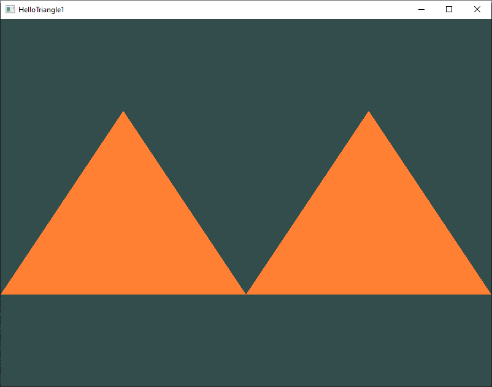
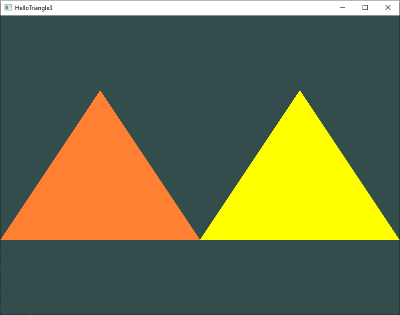

# 1 - HelloTriangle

## 1
Try to draw 2 triangles next to each other using glDrawArrays by adding more vertices to your data

## 2
Now create the same 2 triangles using two different VAOs and VBOs for their data

## 3
Create two shader programs where the second program uses a different fragment shader that outputs the color yellow; draw both triangles again where one outputs the color yellow

