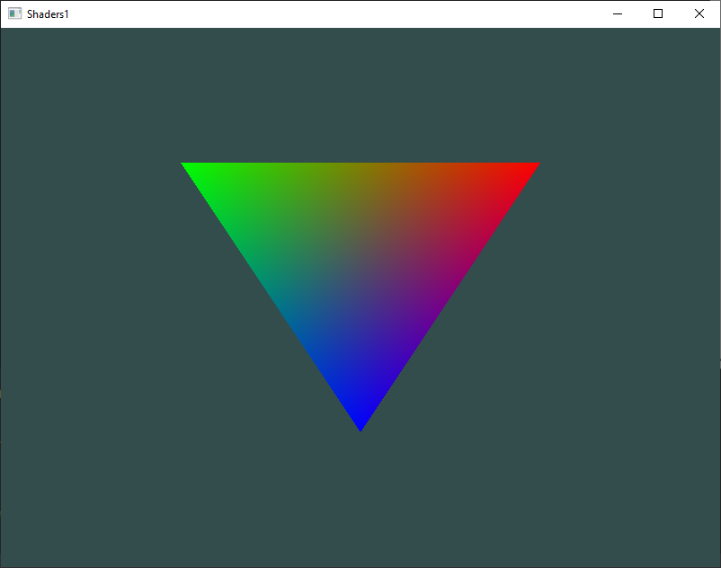
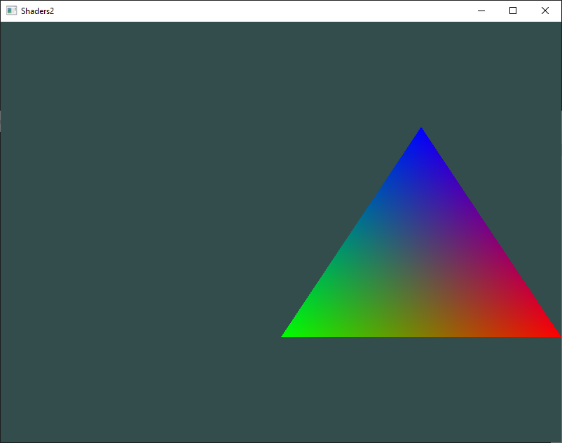
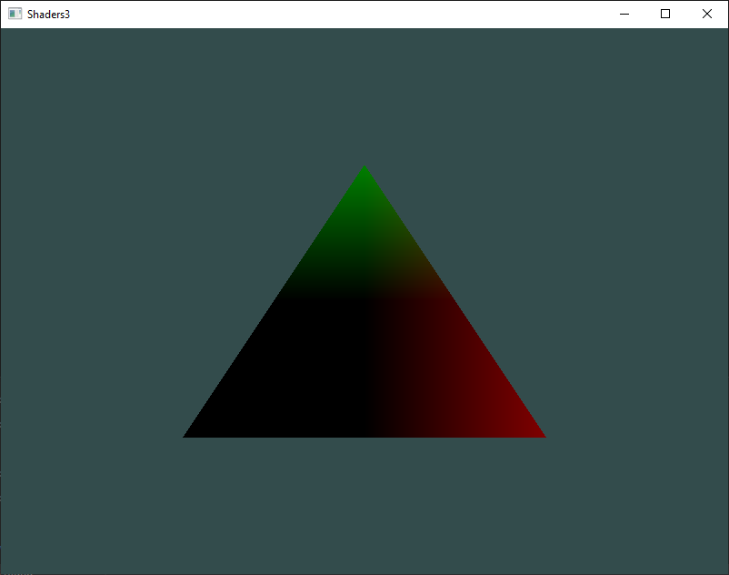
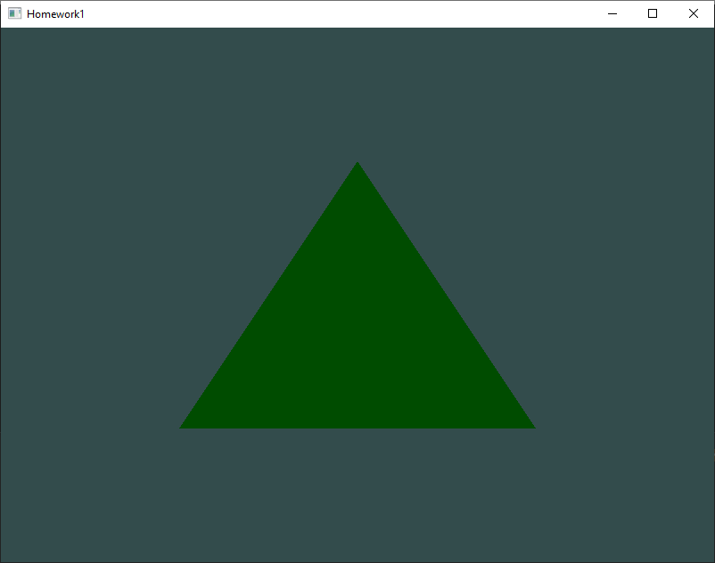
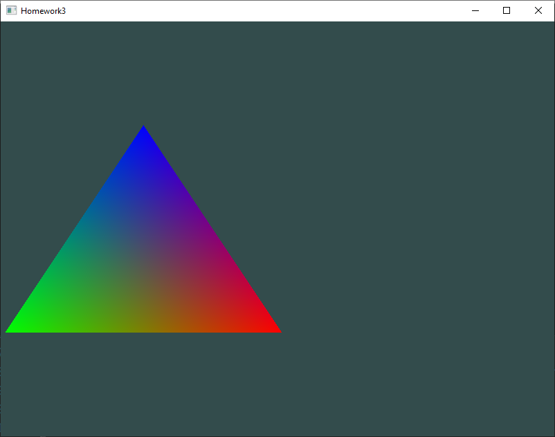

# 2 - Shaders

## 1
Adjust the vertex shader so that the triangle is upside down

## 2
Specify a horizontal offset via a uniform and move the triangle to the right side of the screen in the vertex shader using this offset value

## 3
Output the vertex position to the fragment shader using the out keyword
and set the fragment's color equal to this vertex position
(see how even the vertex position values are interpolated across the triangle).

Once you managed to do this; try to answer the following question:
why is the bottom-left side of our triangle black?

*Answer*: we are passing the vertices coordinates to the fragment shader as the output
of the vertex shader. Since the bottom-left side of the triangle has coordinates
(-0.5, -0.5, 0.0), when the fragment shader assigns the value of the color of a
single fragment it clamps the negative values to 0.0, creating the triple (0.0, 0.0, 0.0),
because the X and Y coordinates become 0.0 and the Z coordinate is already 0. This triple
represents the RGB color of the fragment and it corresponds to black.

## Homework 1
Put the green channel in a uniform variable and change its value at run-time

## Homework 2
The same as exercise [1](#1)

## Homework 3
Set an horizontal offset using uniform variable and update it over the time

## Homework 4
The same as exercise [3](#3)
