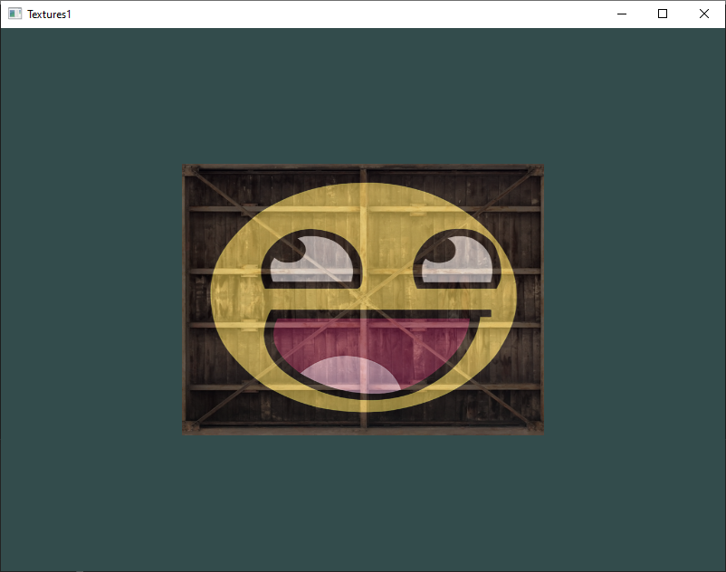
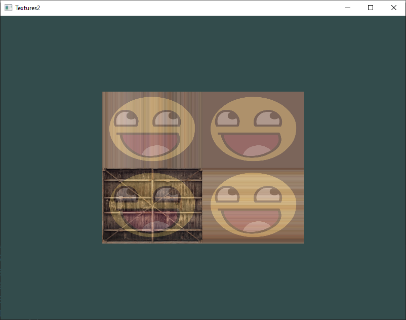
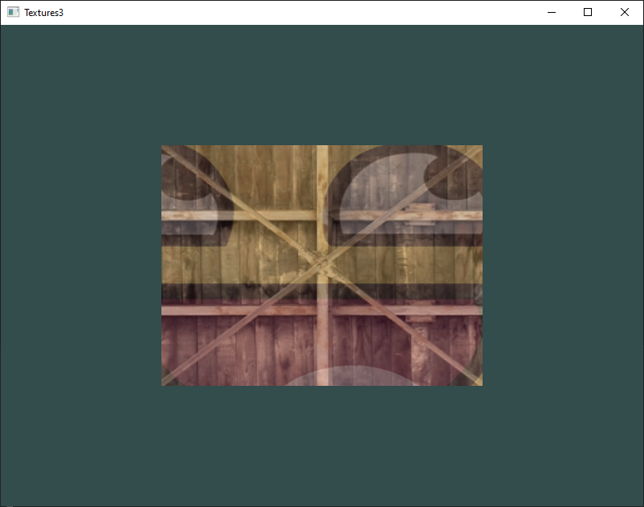
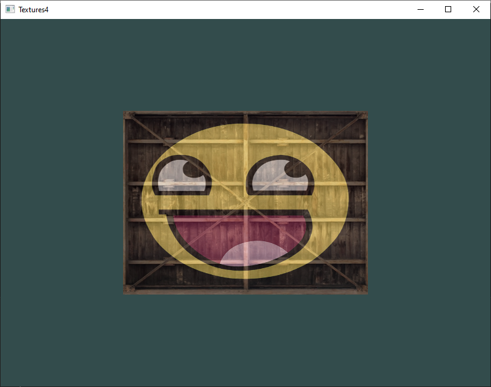
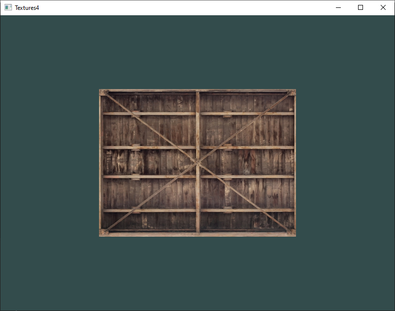
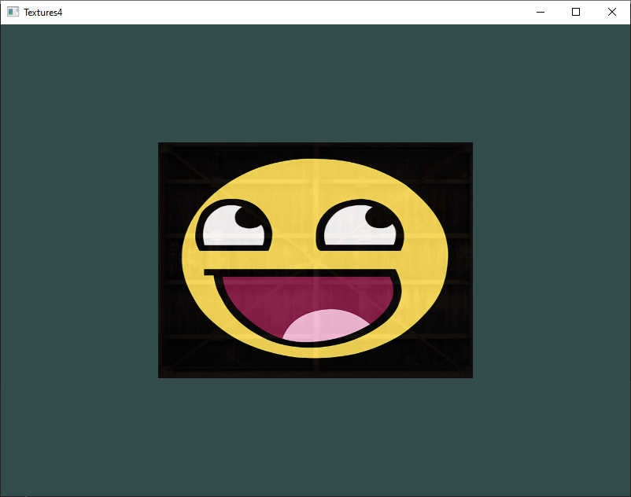

# 3 - Textures

## 1
Make sure **only** the happy face looks in the other/reverse direction by changing the fragment shader

## 2
Experiment with the different texture wrapping methods by specifying texture coordinates in the range `0.0f` to `2.0f` instead of `0.0f` to `1.0f`. See if you can display 4 smiley faces on a single container image clamped at its edge

## 3
Try to display only the center pixels of the texture image on the rectangle in such a way that the individual pixels are getting visible by changing the texture coordinates. Try to set the texture filtering method to GL_NEAREST to see the pixels more clearly

## 4

Use a uniform variable as the mix function's third parameter to vary the amount the two textures are visible. Use the up and down arrow keys to change how much the container or the smiley face is visible

## Homework 1

The same as exercise [1](#1)

## Homework 2
The same as exercise [2](#2)

## Homework 3
The same as exercise [4](#4) (both versions with the mix value change are implemented, using arrow keys and using the time, see function `getMixValue()`)

