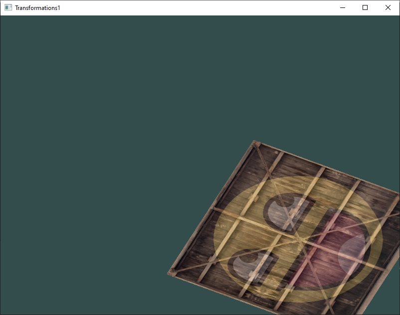
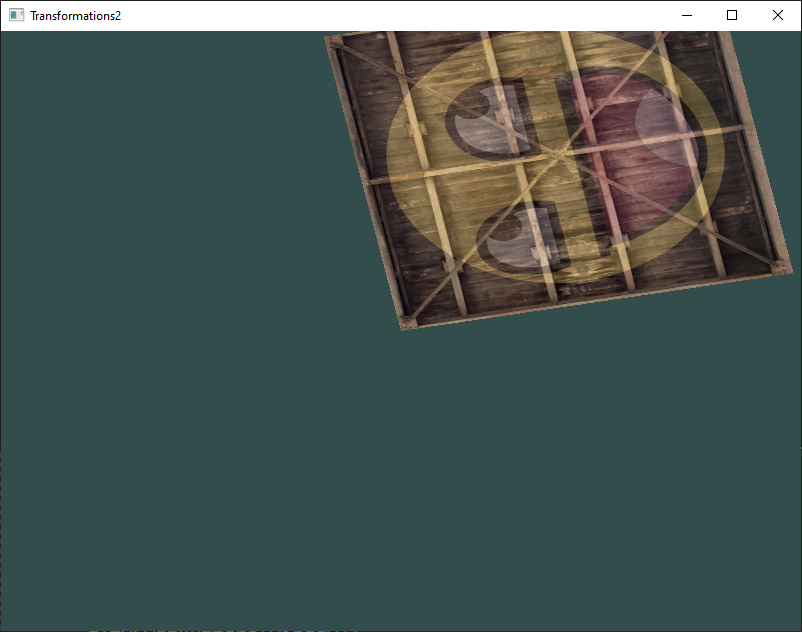
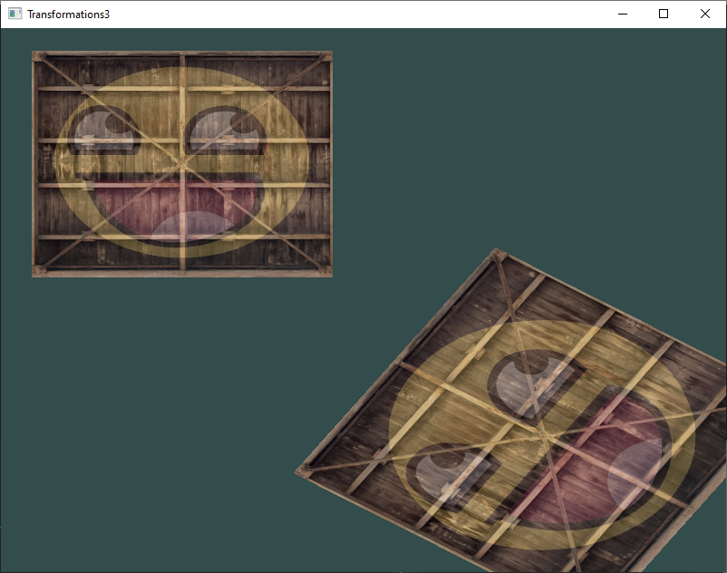

# 4 - Transformations

## 1
A translated container that’s rotated over time

## 2
Using the last transformation on the container, try switching the order around by first rotating and then translating. See what happens and try to reason why this happens.

*Answer:* This time, the rectangle is first translated and then rotated. So the rectangle is shifted to the bottom right corner and then it starts rotating around the center of the window.

## 3
Try drawing a second container with another call to glDrawElements but place it at a different position using transformations only. Make sure this second container is placed at the top-left of the window and instead of rotating, scale it over time (using the sin function is useful here; note that using sin will cause the object to invert as soon as a negative scale is applied)

