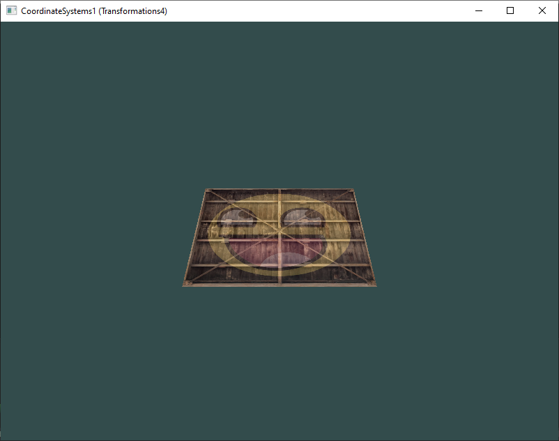
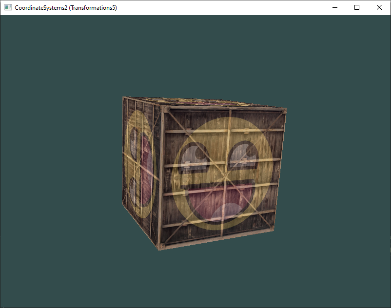
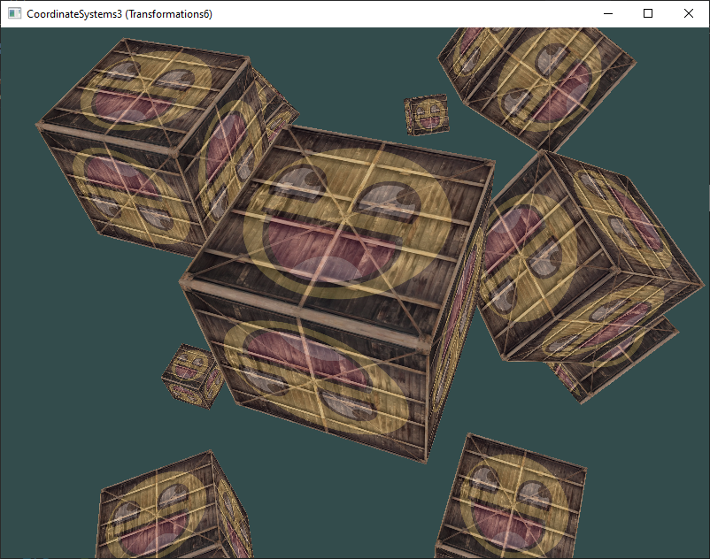

# 5 - Coordinate Systems

## 1 (Transformations4)
Play around with model, view and projection matrices

## 2 (Transformations5)
Rotating Cube and depth: Define a cube and use depth buffer for hidden surface removal

## 3 (Transformations6)
Instantiate more cubes at different position and orientations. Try to make every 3rd container (including the 1st) rotate over time, while leaving the other containers static using just the model matrix

