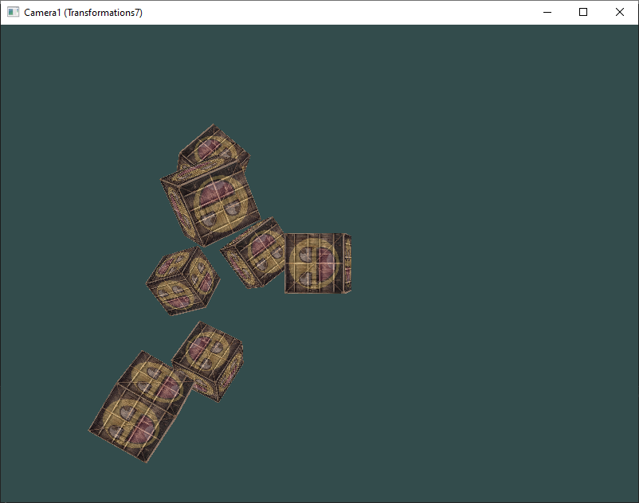

# 6 - Camera

## 1 (Transformations7)
Set camera view

## 2 (Transformations8)
Use key to move the camera

## 3
See if you can transform the camera class in such a way that it becomes a true fps camera where you cannot fly; you can only look around while staying on the xz plane

## 4

Try to create your own LookAt function where you manually create a view matrix as discussed at the start of this chapter. Replace glm's LookAt function with your own implementation and see if it still acts the same
