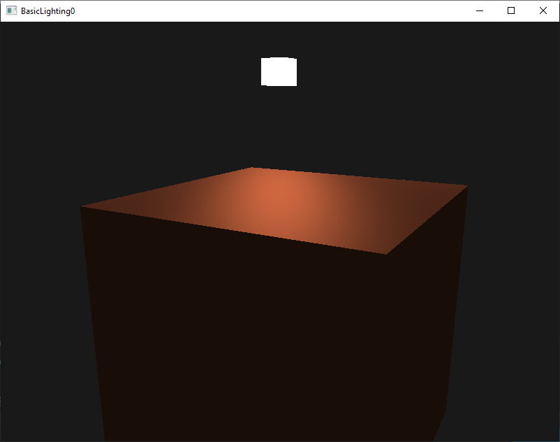
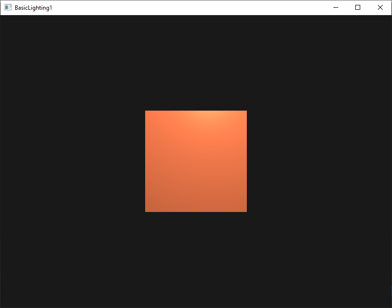
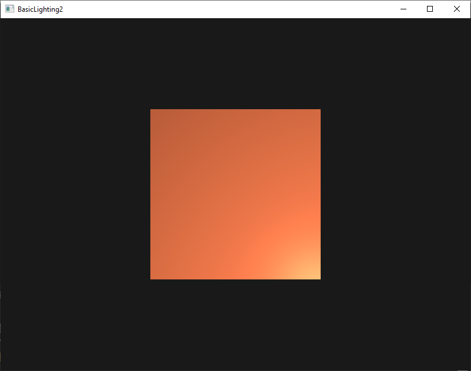
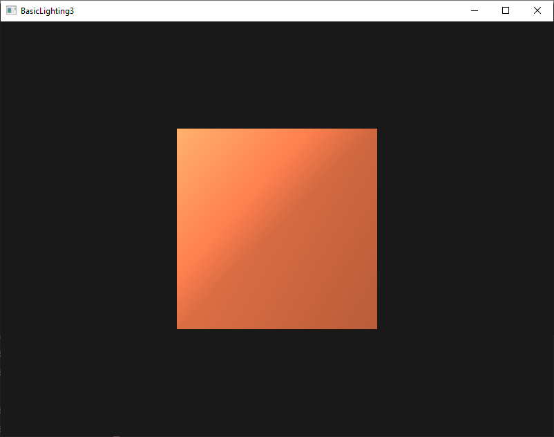

# 2 - Basic Lighting

## 0

Intro to lighting

## 1
Right now the light source is a boring static light source that doesn't move. Try to move the light source around the scene over time using either sin or cos. Watching the lighting change over time gives you a good understanding of Phong's lighting model

## 2
Do Phong shading in view space instead of world space

## 3
Implement Gouraud shading instead of Phong shading. If you did things right the lighting should look a bit off (especially the specular highlights) with the cube object. Try to reason why it looks so weird

*Answer*: Since we are now calculating the light reflection in the vertices (in the vertex shader) and not in the single fragment (fragment shader), the result is that the color calculated in the vertices gets interpolated to get the color inside the triangles. This causes an unnatural effect, since the light highlights the two separated triangles.

