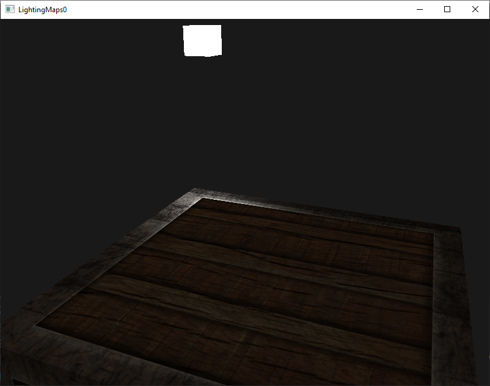
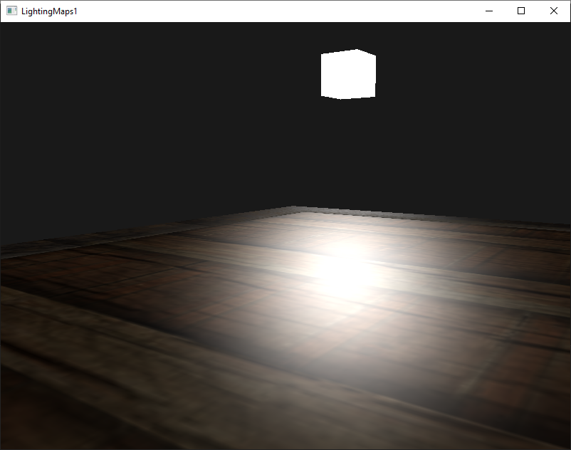
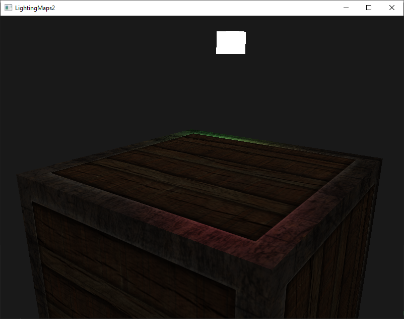
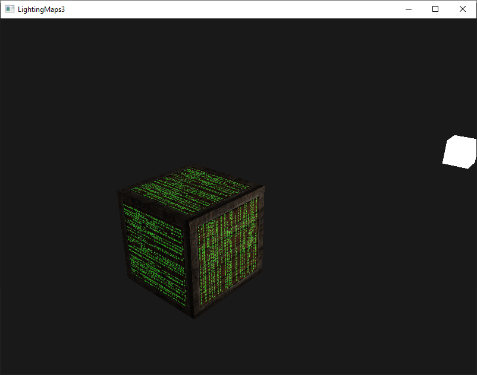

# 4 - Lighting Maps

## 0

Diffuse and specular with textures

## 1 (Homework1)
Try inverting the color values of the specular map in the fragment shader so that the wood shows specular highlights and the steel borders do not (note that due to the cracks in the steel border the borders still show some specular highlight, although with less intensity)

## 2

Try creating a specular map from the diffuse texture that uses actual colors instead of black and white and see that the result doesn't look too realistic

## 3

Also add something they call an emission map which is a texture that stores emission values per fragment. Emission values are colors an object may emit as if it contains a light source itself; this way an object can glow regardless of the light conditions. Emission maps are often what you see when objects in a game glow (like eyes of a robot, or light strips on a container)

