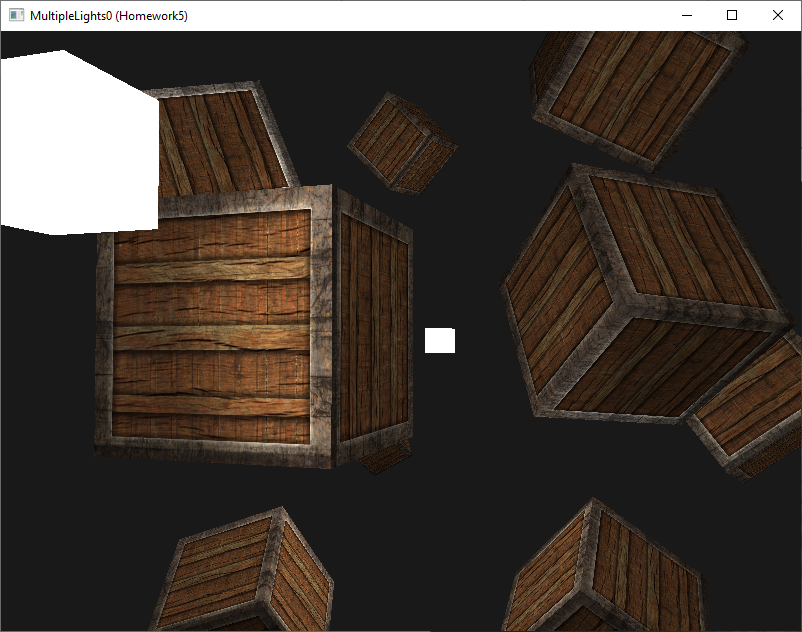
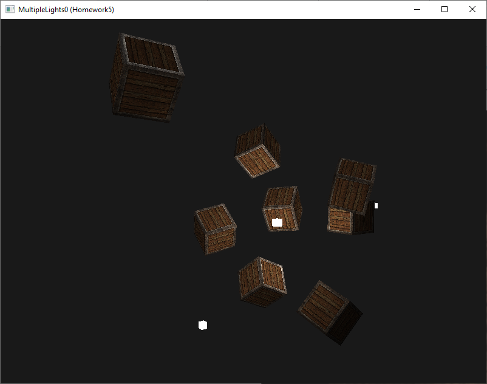

# 6 - Multiple Lights

## 0 (Homework5)

Combine multiple types of light in the same scene

## 1
Can you (sort of) re-create the different atmospheres of the last image by tweaking the light's attribute values?

This program uses **ImGui** to create a window where the values of the lights can be changed

https://github.com/leofracca/GraphicsProgrammingExercises/assets/32203200/9db97647-6e0f-4c33-b7b1-afb2e824ca12

